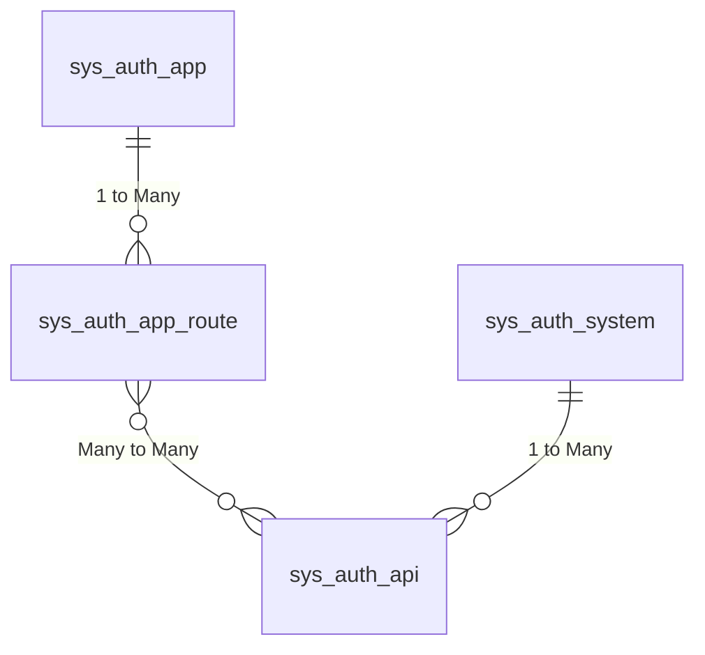

# 数据表设计文档

这个系统设计旨在管理应用、接口路由和系统之间的关联关系，以便实现接口白名单的配置和权限管理。

### 数据表设计文档

#### sys_auth_app 表
- **id**: INT - 应用ID (主键)
- **app_key**: VARCHAR(32) - 应用标识符
- **secret_key**: VARCHAR(128) - 应用私钥
- **name**: VARCHAR(50) - 应用名称
- **description**: VARCHAR(200) - 应用描述
- **api_limit**: INT - API访问限制
- **ip_limit_type**: TINYINT - IP限制类型 (0: 白名单, 1: 黑名单)
- **ip_white_list**: VARCHAR(200) - IP白名单
- **ip_black_list**: VARCHAR(200) - IP黑名单
- **status**: TINYINT - 应用状态 (0: 待审核, 1: 通过, 2: 拒绝)
- **created_at**: DATETIME - 创建时间
- **updated_at**: DATETIME - 更新时间

#### sys_auth_api 表
- **id**: INT - 路由ID (主键)
- **system_id**: INT - 系统ID (外键关联 sys_auth_system)
- **name**: VARCHAR(50) - 路由名称
- **route**: VARCHAR(100) - 路由地址
- **created_at**: DATETIME - 创建时间
- **updated_at**: DATETIME - 更新时间

#### sys_auth_app_route 表
- **id**: INT - 关联ID (主键)
- **app_id**: INT - 应用ID (外键关联 sys_auth_app)
- **api_id**: INT - 路由ID (外键关联 sys_auth_api)
- **created_at**: DATETIME - 创建时间
- **updated_at**: DATETIME - 更新时间

#### sys_auth_system 表
- **id**: INT - 系统ID (主键)
- **key**: VARCHAR(32) - 系统标识
- **name**: VARCHAR(100) - 系统名称
- **domain**: VARCHAR(100) - 系统域名
- **created_at**: DATETIME - 创建时间
- **updated_at**: DATETIME - 更新时间

## ER关系图

